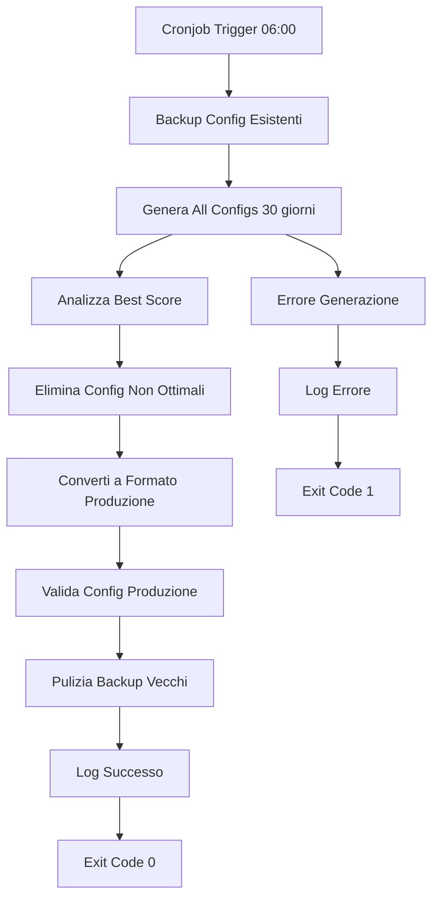

# DAILY CONFIG UPDATER - Automazione Configurazioni

Sistema automatizzato per aggiornamento giornaliero delle configurazioni ottimali The5ers.

## 🎯 PANORAMICA

Il **Daily Config Updater** combina:
- **Autonomous High Stakes Optimizer**: Genera configurazioni ottimali da dati ultimi 30 giorni
- **Production Converter**: Converte automaticamente al formato produzione
- **Gestione Backup**: Mantiene backup delle configurazioni precedenti
- **Logging Completo**: Log dettagliati per monitoring

## 🔧 COMPONENTI

### Script Principale
- `daily_config_updater.py` - Orchestratore principale
- `daily_config_updater.bat` - Launcher Windows

### Funzionalità
1. **Backup** configurazioni esistenti
2. **Genera** configurazione ottimale (Auto-Best su 30 giorni)
3. **Converte** a formato produzione
4. **Pulisce** backup vecchi (>7 giorni)
5. **Log completo** di tutte le operazioni

## 🚀 UTILIZZO

### Esecuzione Manuale

```bash
# Esecuzione base (30 giorni ottimizzazione)
python daily_config_updater.py

# Con parametri personalizzati
python daily_config_updater.py --days 45 --no-backup --quiet
```

### Parametri Disponibili
- `--days N`: Giorni di ottimizzazione (default: 30)
- `--no-backup`: Disabilita backup configurazioni esistenti
- `--quiet`: Solo log su file, niente output console

### Windows Batch
```cmd
daily_config_updater.bat
```

## ⏰ CONFIGURAZIONE CRONJOB

### Windows Task Scheduler

1. **Apri Task Scheduler** (`taskschd.msc`)

2. **Crea Attività di Base**:
   - Nome: `The5ers Daily Config Update`
   - Descrizione: `Aggiornamento automatico configurazioni trading`

3. **Trigger**:
   - **Frequenza**: Giornaliera
   - **Ora**: `06:00` (prima dell'apertura mercati)
   - **Ricorrenza**: Ogni giorno
   - **Avvia**: Data odierna

4. **Azione**:
   - **Programma**: `python.exe`
   - **Argomenti**: `daily_config_updater.py --quiet`
   - **Directory**: `C:\KLMNR_Projects\KLMNR_Phoenix_Quantum\legacy_system\backtest_legacy`

5. **Condizioni**:
   - ✅ Avvia solo se computer su rete AC
   - ✅ Riattiva computer per eseguire attività
   - ❌ Avvia solo se computer è inattivo

6. **Impostazioni**:
   - ✅ Consenti esecuzione su richiesta
   - ✅ Esegui attività ASAP dopo avvio pianificato mancato
   - ❌ Interrompi attività se eseguita per più di: 1 ora

### Linux/macOS Crontab

```bash
# Edita crontab
crontab -e

# Aggiungi riga per esecuzione giornaliera alle 06:00
0 6 * * * cd /path/to/KLMNR_Phoenix_Quantum/legacy_system/backtest_legacy && python daily_config_updater.py --quiet

# Verifica crontab
crontab -l
```

### Orari Consigliati
- **06:00**: Prima dell'apertura mercati
- **23:00**: Dopo chiusura mercati US
- **01:00**: Durante pausa mercati (tra US e Asia)

## 📊 MONITORING

### Log Files
```
legacy_system/logs/
├── daily_config_updater_20250720.log
├── daily_config_updater_20250721.log
└── ...
```

### Struttura Log
```
2025-07-20 06:00:01 - INFO - 🚀 AVVIO AGGIORNAMENTO GIORNALIERO CONFIG
2025-07-20 06:00:01 - INFO - 📅 Data: 2025-07-20 06:00:01
2025-07-20 06:00:02 - INFO - 💾 Backup configurazioni esistenti...
2025-07-20 06:00:05 - INFO - 🎯 Generazione configurazione ottimale...
2025-07-20 06:00:45 - INFO - 🥇 MIGLIORE: CONSERVATIVE (Score: 758.42)
2025-07-20 06:00:46 - INFO - 🔄 Conversione a formato produzione...
2025-07-20 06:00:47 - INFO - ✅ Conversione completata
2025-07-20 06:00:47 - INFO - 🎉 AGGIORNAMENTO GIORNALIERO COMPLETATO!
```

### Controllo Successo
```bash
# Verifica exit code
echo $?  # 0 = successo, 1 = errore

# Verifica file generati
ls -la legacy_system/config/*production_ready.json
```

## 📁 OUTPUT FILES

### File Generati Giornalmente
```
legacy_system/config/
├── config_autonomous_high_stakes_conservative.json          # Config ottimale
├── config_autonomous_high_stakes_conservative_production_ready.json  # Formato produzione
└── backups/
    └── 20250720_060001/                                    # Backup giornaliero
        ├── config_autonomous_high_stakes_conservative.json (backup precedente)
        └── old_production_ready.json (backup precedente)
```

### Rotazione Backup
- **Retention**: 7 giorni
- **Pulizia automatica**: Backup oltre 7 giorni vengono rimossi
- **Struttura**: `backups/YYYYMMDD_HHMMSS/`

## 🔧 TROUBLESHOOTING

### Problemi Comuni

#### Errore Import Moduli
```bash
# Verifica moduli
python -c "from autonomous_high_stakes_optimizer import AutonomousHighStakesOptimizer; print('OK')"
python -c "from config_converter import ConfigConverter; print('OK')"
```

#### Errore Permessi Directory
```bash
# Windows
icacls "C:\KLMNR_Projects\KLMNR_Phoenix_Quantum\legacy_system" /grant Users:F

# Linux/macOS  
chmod -R 755 /path/to/KLMNR_Phoenix_Quantum/legacy_system
```

#### Task Scheduler Non Funziona
1. Verifica **credenziali** account
2. Controlla **percorsi assoluti**
3. Testa **esecuzione manuale** prima
4. Verifica **privilegi** account

### Log Errors Comuni
```
❌ Errore import: No module named 'autonomous_high_stakes_optimizer'
→ Controlla PYTHONPATH e directory di esecuzione

❌ Template produzione non trovato
→ Verifica esistenza PRO-THE5ERS-QM-PHOENIX-GITCOP-config-STEP1.json

❌ Errore validazione: Sezione symbols mancante
→ Problema nel processo di ottimizzazione, controlla log precedenti
```

## 🎯 WORKFLOW COMPLETO



## 💡 BEST PRACTICES

### Scheduling
- **Non sovrapporre** esecuzioni (max 1 ora durata)
- **Monitoring** log giornalieri
- **Alerting** su fallimenti

### Maintenance
- **Verifica mensile** spazio disco (log + backup)
- **Review trimestrale** parametri ottimizzazione
- **Test periodico** esecuzione manuale

### Production Usage
```bash
# Setup produzione con monitoring
python daily_config_updater.py --days 30 --quiet && \
  echo "$(date): Config update SUCCESS" >> /var/log/the5ers.log || \
  echo "$(date): Config update FAILED" >> /var/log/the5ers.log
```
