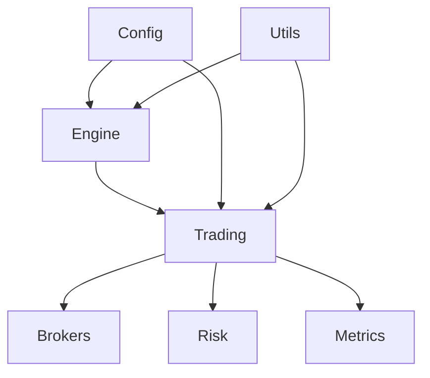

# Indice

- [Panoramica Generale](#panoramica-generale)
- [Moduli Principali](#moduli-principali)
- [Diagramma Architetturale](#diagramma-architetturale)
- [Flusso Operativo](#flusso-operativo)
- [Esempio di codice (Python)](#esempio-di-codice-python)
- [Note di Design](#note-di-design)


***

- [Engine](../MODULES/engine.md)
- [Risk](../MODULES/risk.md)
- [Metrics](../MODULES/metrics.md)
- [Config](../MODULES/config.md)
- [Trading](../MODULES/trading.md)
- [Brokers](../MODULES/brokers.md)
- [Utils](../MODULES/utils.md)

- [Guida Installazione](../GUIDES/setup.md)
- [Guida Multi-Broker](../GUIDES/multi_broker.md)
- [Daily Updater](../GUIDES/README_DAILY_UPDATER.md)
- [Avvio Automatico](../GUIDES/README_AVVIO_AUTOMATICO.md)


***
# Quantum Trading System - Architettura

## Panoramica Generale
Sistema modulare per trading quantistico, progettato per scalabilità, automazione e multi-broker.

### Moduli Principali
- **engine**: Generazione segnali e logica quantistica
- **risk**: Gestione rischio, drawdown, protezione capitale
- **metrics**: Analisi performance, metriche custom
- **config**: Gestione configurazioni, mapping simboli
- **trading**: Coordinamento multi-broker, orchestrazione ordini
- **brokers**: Integrazione API broker
- **utils**: Utility, logging, mapping

## Diagramma Architetturale


## Flusso Operativo
1. **Avvio sistema**: Caricamento configurazione, setup moduli
2. **Generazione segnali**: Engine elabora dati e produce segnali
3. **Gestione rischio**: Modulo risk valuta operatività
4. **Esecuzione ordini**: Trading coordina invio ordini ai broker
5. **Monitoraggio**: Metrics raccoglie dati, logging continuo

## Esempio di codice (Python)
```python
from engine import SignalEngine
from trading import TradingCoordinator

engine = SignalEngine(config)
signals = engine.generate_signals()

trader = TradingCoordinator(config)
trader.execute(signals)
```

## Note di Design
- Separazione netta tra logica di business e integrazione broker
- Configurazione centralizzata e validazione automatica
- Supporto multi-device e monitoring real-time


***
File unificato da README_PROJECT_OVERVIEW.md e ARCHITECTURE.md
